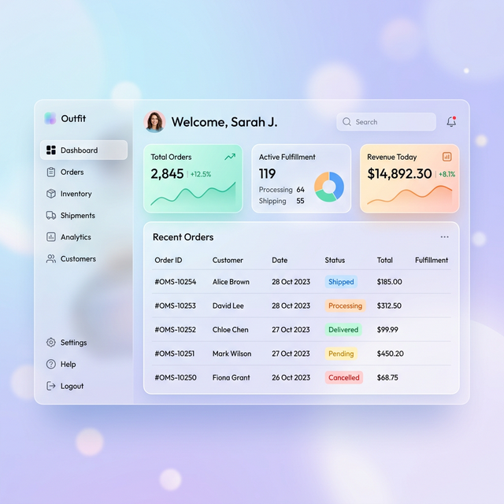

# UIビジュアルコンセプト: Soft Modern / Glassmorphism

受注管理システム（OMS）を、先進的で清潔感のあるデザインに刷新するためのビジュアルガイドです。

## 1. ビジュアルイメージ (Mockup)

## 2. デザインの柱 (Design Pillars)

### 💠 透明感 (Glassmorphism)
背景の柔らかなグラデーションを透過させる「磨りガラス」エフェクトをカードに使用します。これにより、画面に奥行きと軽やかさが生まれます。

### 🎨 彩り (Vibrant Accents)
基本は清潔感のある白と淡いブルーですが、「受注ステータス」や「重要指標」には鮮やかで目に優しいアクセントカラーを使用し、直感的な操作を助けます。

### 📐 空間表現 (Spatial Hierarchy)
サイドバーを採用することで、メインコンテンツの表示領域を最大化します。要素間の余白を贅沢に使い、情報が整理された印象を与えます。

### ✒️ モダンな書体 (Typography)
- **Display**: `Outfit` (丸みのある幾何学的サンセリフ)
- **Body**: `Plus Jakarta Sans` (現代的で読みやすいサンセリフ)

---

## 3. 次のステップ
1. **共通レイアウトの刷新**: サイドバーと背景グラデーションを `base.html` に実装します。
2. **デザインシステムの定義**: 色や余白をCSS変数として定義し、システム全体で統一感を出します。
3. **各画面の移行**: 本イメージを基準に、ダッシュボードから順次アップデートしていきます。

このイメージで進めてよろしいでしょうか？
